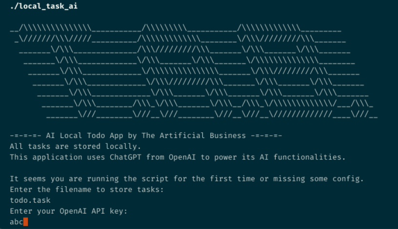
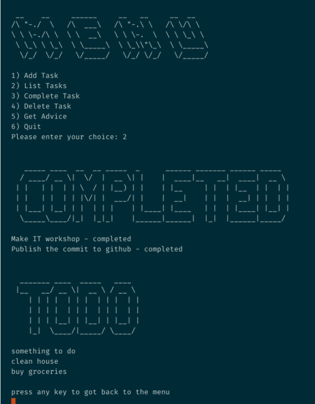

# AI Local Todo App

AI Local Todo App is a command-line task management application powered by OpenAI's ChatGPT. All tasks are stored locally on your machine.

## Prerequisites

- Bash shell (Unix or Git Bash on Windows)
- curl
- jq

## Installation

1. Clone this repository to your local machine.
2. Navigate to the directory containing the script.

## Configuration

The application uses a `.env` file to store configuration. The following variables can be set:

- `TASK_FILE`: The file where tasks will be stored.
- `API_KEY`: Your OpenAI API key.

If these variables are not set, the application will prompt you for them the first time it is run.

## Usage

Run the script with the command `./local_task_ai`.

The application will present you with a menu of options:

1. **Add Task**: Add a new task to your task list.
2. **List Tasks**: Display all tasks, both completed and not completed.
3. **Complete Task**: Mark a task as completed.
4. **Delete Task**: Delete a task from the list.
5. **Get Advice**: Get advice on how to prioritize your tasks from ChatGPT.
6. **Quit**: Exit the application.

## Contributing

Pull requests are welcome. For major changes, please open an issue first to discuss what you would like to change.

## License

[MIT](./LICENSE)